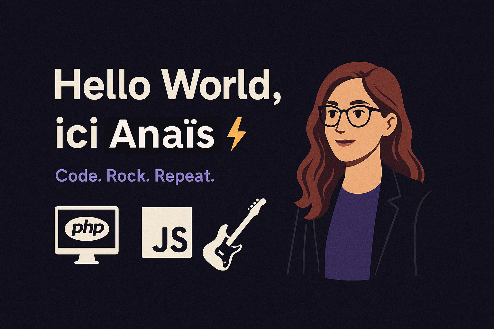

Dév web & bidouilleuse dans l’âme, je jongle entre **PHP**, **JavaScript** et mes riffs de guitare. Passionnée par les **IA**, le **code clean**, et les **univers immersifs** (RPG, jeux narratifs...), j’aime donner vie à des projets qui ont du style et du sens.

🧠 Toujours en train d’apprendre, toujours prête à tout donner pour mieux comprendre.  
🎸 Et quand je code pas… je joue. À la gratte ou à la console.

  
   
  
  
    
  
   
  
    
  
  

---

## 🚀 Stack & Compétences

- 🔹 **Backend** : PHP (Symfony, CodeIgniter, Laravel), Node.js, Fat-Free (en cours)
- 🔹 **Frontend** : Next.js, React, Tailwind CSS, Ember Octane (à apprivoiser)
- 🔹 **Bases de données** : PostgreSQL, MySQL, MariaDB
- 🔹 **Autres** : Git, GitHub Actions, Supabase, ELK (notions), RabbitMQ, SolR, Docker (WIP)

---

## 💼 Projets cools

- 🔍 [Nexus Aventures](https://github.com/Kinnixx/nexus-aventures) : Jeu narratif aux multiples aventures / univers, en Next.js & Tailwind (Privé, me demander l'accès !)
- 📡 [PulseTrack](https://github.com/Kinnixx/pulse-track) : Tableau de bord léger de **monitoring** & **logging** en temps réel  
  > Démo technique en cours de dev, vitrine de ma montée en compétences sur une stack moderne :  
  > PHP 8.2 (Fat-Free) · MariaDB · RabbitMQ · SolR · ELK · Ember Octane · Docker  
  >  
  > 💡 Simule des flux d'événements temps réel, avec API REST, queue, logs consultables et dashboard full-stack.
- 🎸 Portfolio : En cours de montage, stay tuned 😏

*(Tu veux me voir en action ? Clique 👆)*

---

## 📈 GitHub Stats

<picture>
  <source media="(prefers-color-scheme: dark)" srcset="https://github.com/Kinnixx/snk/blob/output/github-snake-dark.svg" />
  <source media="(prefers-color-scheme: light)" srcset="https://github.com/Kinnixx/snk/blob/output/github-snake.svg" />
  
</picture>

---

## 🎸 À propos de moi

- 🔥 Toujours un projet perso en cours (ou deux… ou trois)
- 🛠️ Team clavier méca, dark mode & terminal ouvert H24
- ⚔️ Passion IA / Tech / Guitare
- 🎮 RPG, FPS, narratif : les jeux, c’est plus qu’un hobby

📫 **Contacte-moi** : [LinkedIn](https://www.linkedin.com/in/anaïs-delattre/) | [Mail](mailto:anais.delattre1@gmail.com)

---

## 🧠 Citation qui me suit partout :

> "Stay curious, break things, rebuild better." – *Moi-même, après un `rm -rf`*

---

✨ *Code. Rock. Repeat.* ✨
